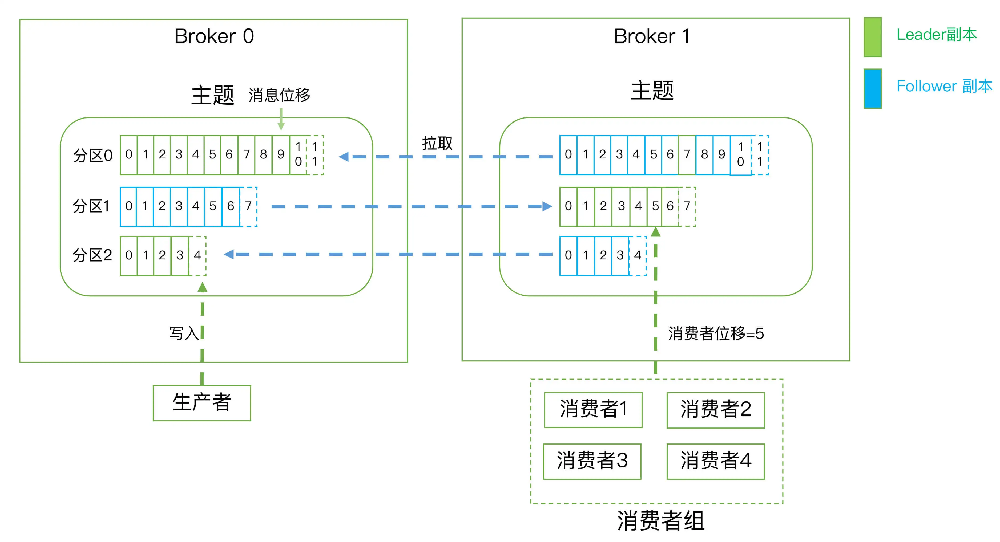

# kafka相关概念

## broker
- kafka的服务实例
- 一般一个节点只部署一个broker实例

## topic

- 消息主题，是承载消息的逻辑容器

## partition

- 分区，有序不变的消息序列
- 一个topic可以有多个分区
- 消息在分区中的位置通过一个offset来表征

## rereplica 副本

- 一个partition有一个leader副本和多个follower副本
- consumer只和partition中的leader副本通信
- `生产者`总是向领导者副本写消息；而`消费者`总是从领导者副本读消息
- 追随者副本，向领导者副本发送请求，请求领导者把最新生产的消息发给它，这样它能保持与领导者的同步，做数据冗余之用

## comsumer group

- 消费者组，多个消费者实例共同组成一个组，消费topic中partition消息
- 一个partition的消息只能被一个消费者消费
- 消费者位移：Consumer Offset，记录消费者消费到分区消息的哪个位置

## rebalance

- 某个消费者实例挂掉了，可以把该消费者的分区转移给其他消费者

## 如何持久化

- 使用消息日志来保存数据
- 一个日志在磁盘上一个只能追加写的消息文件，避免缓慢的随机io操作，高吞吐量的一个重要手段
- 日志写入通过写入到最新的日志段中，写满一个log segmnent，新切分出一个新的log segment，老的segment封存，定期检查老的segment是否能够被删除，从而实现回收磁盘空间的目的

